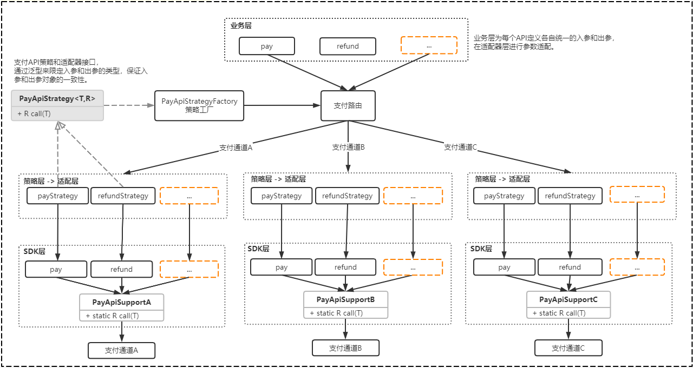

# pay-route

#### 介绍
一个优雅的聚合支付网关路由。不依赖任何第三方 MVC 框架，仅仅作为工具使用简单快速完成支付模块的开发，可轻松嵌入到任何系统里。 

另外可以结合文章 [支付网关路由之设计方案实战]( https://blog.csdn.net/icansoicrazy/article/details/106926796 )  来阅读，该文章中详细介绍了本方案的演进过程。


> 不同公司支付路由的使用场景和接入的第三方支付可能不同，有的直连微信和支付宝，有的接入聚合支付通道，有的需要智能路由，有的只需简单路由，所以请将关注点重点放在设计方案这个层面，因为设计思想可以复用到别的场景，而代码则不一定适用。不仅要做一个会搬运代码的搬运工，还要做一个有灵魂的码农。


#### 软件架构



1、支付路由

> `PayApiRoute` 所有支付API的统一入口。

2、策略工厂

> `PayApiStrategyFactory` 创建策略的工厂。通过容器来管理所有的单例策略Bean。

3、策略层

> `PayApiStrategy` 顶层策略接口。
>
> 每一个支付API对应一个策略类。
>
> 在策略类中完成业务层统一参数和支付API参数的适配，所以策略类同时也是一个适配器。

4、SDK层

> 将对接支付通道API的共性逻辑（签名/验签/参数处理/发送请求）抽象出来，定义一个统一入口， 通过泛型来限定入参和出参的类型，保证入参和出参对象的一致性。接当入新的API时，只需要定义入参和出参对象即可，保证高效高质量的接入。

5、统一入参和出参

> 业务层只识别统一的参数，其目的是消除不同支付通道之间的差异化参数，将参数的适配下沉到策略层或适配层，对业务层而言屏蔽了实现细节。


#### 安装教程

1. 克隆代码

   ```shell
   git clone https://gitee.com/ckcoy/pay-route.git
   ```

2. 打包

   ```shell
   mvn clean install -Dmaven.test.skip=true
   ```

3. 引入jar包

   ```xml
   <dependency>
       <groupId>com.coy.pay</groupId>
       <artifactId>pay-route</artifactId>
       <version>1.0.0</version>
   </dependency>
   ```

#### 使用说明

使用很简单，只需要构建好对应的`入参Input`和`出参Result`，直接调用`PayApiRoute.call(input)`即可。

详细使用方式见测试用例：`com.coy.pay.route.PayApiTest` 

```java
// 公共参数设置
public static void setCommonParam(PayApiInput input) {
    input.setUrl(requesturi);
    input.setAgentno(signId);
    input.setSecretKey(secretKey);
    input.setMchId(mchId);
    input.setSignType(signType);
    input.setPayPassId(payPassId);
    input.setOpUserId(mchId);// 操作员帐号,默认为商户号
}

// 交易查询
@Test
public void payQuery() {
    PayQueryInput input = new PayQueryInput();
    setCommonParam(input);// 公共参数设置
    input.setListid(listid);
    PayQueryResult result = PayApiRoute.call(input);// 调用支付API
    System.out.println(JSON.toJSONString(result));
}
```


```java
// 微信公众号支付
@Test
public void weixinJSPay() {
    WeixinJSPayInput input = new WeixinJSPayInput();
    setCommonParam(input);// 公共参数设置
    input.setListid(listid);
    input.setBody("测试商品");
    input.setTotalFee(1L);
    input.setMchCreateIp("127.0.0.1");
    input.setNotifyUrl("http://paydev1.test.xxx.com/buy_pcard_notify");
    input.setCallbackUrl("http://eppc.xxx.com");// 公众号支付
    input.setDeviceInfo("MEMEPPC_WX");
    input.setIs_minipg("0");// 小程序支付

    Calendar calendar = Calendar.getInstance();
    input.setTimeStart(calendar.getTime());
    calendar.add(Calendar.MINUTE, 30);
    input.setTimeExpire(calendar.getTime());
    input.setOpenid("ofDK05O8FrzOEw91-_MBMuRRUKK0");
    input.setSubOpenid("ofDK05O8FrzOEw91-_MBMuRRUKK0");
    input.setSubAppid("wx6edbb4aa778ac786");// 汇商通盈

    WeixinJSPayResult result = PayApiRoute.call(input);
    System.out.println(JSON.toJSONString(result));
}
```

```java
// 退款
@Test
public void refund() {
    RefundInput refundInput = new RefundInput();
    setCommonParam(refundInput);
    refundInput.setListid(listid);
    refundInput.setRefundListid(refundListid);
    refundInput.setTotalFee(1L);
    refundInput.setRefundFee(1L);
    refundInput.setDeviceInfo("sss");
    RefundResult refundResult = PayApiRoute.call(refundInput);
    System.out.println(JSON.toJSONString(refundResult));
}
```

```java
// 退款查询
@Test
public void refundQuery() {
    RefundQueryInput input = new RefundQueryInput();
    setCommonParam(input);
    input.setListid(listid);
    input.setRefundListid(refundListid);
    RefundQueryResult result = PayApiRoute.call(input);
    System.out.println(JSON.toJSONString(result));
}
```

